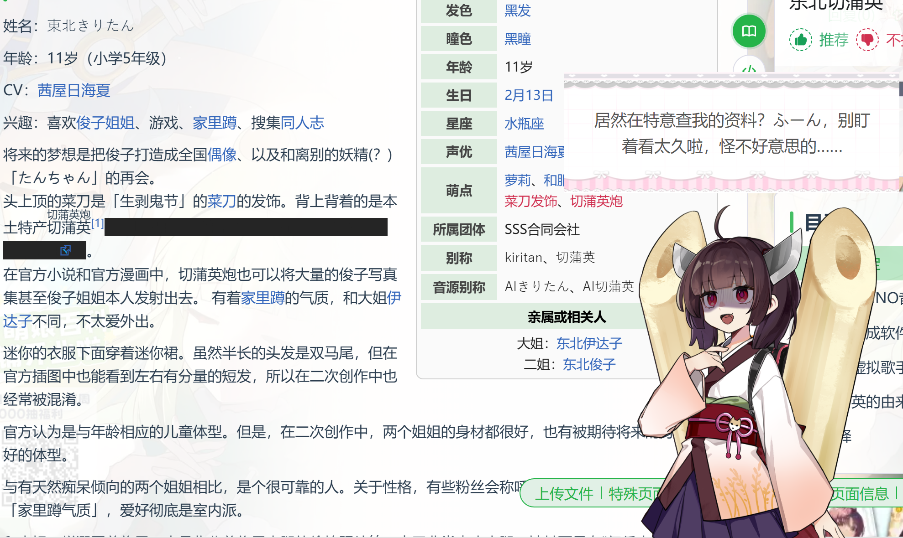

# Live2DPet — AI Desktop Pet Companion

**English** | **[日本語](README.ja.md)** | **[中文](README.md)**

   

> If you find this useful, please consider giving it a [Star](https://github.com/x380kkm/Live2DPet) :)

An Electron-based desktop pet. A Live2D character stays on your desktop, perceives your activity via screenshots, generates companionship dialogue through AI, and speaks with VOICEVOX text-to-speech. Built with AI-assisted development using [Claude Code](https://docs.anthropic.com/en/docs/claude-code).

> **Privacy Notice**: This app periodically captures screenshots and sends them to your configured AI API for analysis. Screenshots are never saved to disk. Make sure you trust your API provider and be mindful of sensitive information displayed on screen.

<p align="center">
  
</p>

## Usage Example

<p align="center">
  
</p>
<p align="center">
  
</p>
<p align="center">
  
</p>

<details>
<summary>Model Credits</summary>

【Model】Little Demon
Author：Cai Cat様

【Model】春日部つむぎ (公式)
イラスト：春日部つくし様
モデリング：米田らん様

【Model】東北きりたん ([水德式](https://www.bilibili.com/video/BV1B7dcY1EFU))
イラスト：白白什么雨様
配布：君临德雷克様

*The models shown in this example are borrowed for demonstration purposes. All rights belong to the original creators.*

</details>

## Quick Start

### Option 1: Download (Recommended)

Download `Live2DPet.exe` from [Releases](https://github.com/x380kkm/Live2DPet/releases). Double-click to run — no installation needed.

### Option 2: Run from Source

```bash
git clone https://github.com/x380kkm/Live2DPet.git
cd Live2DPet
npm install
node launch.js
```

> In VSCode terminal, use `node launch.js` instead of `npx electron .` (ELECTRON_RUN_AS_NODE conflict).

## Usage Guide

### 1. Configure API

Open the settings panel and fill in the "API Settings" tab with your API URL, key, and model name. This app is compatible with any OpenAI-format API endpoint. You can use aggregation platforms such as OpenRouter.

Vision-capable models are recommended for screenshot awareness:
- Budget-friendly: Grok series
- Mid-range: GPT-o3 / GPT-5.1
- High quality: Gemini 3 Pro Preview

Translation API (for TTS Japanese translation):
- OpenRouter `x-ai/grok-4-fast`

### 2. Import Live2D Model

In the "Model" tab, click "Select Model Folder" and choose a directory containing `.model.json` or `.model3.json`. The system will automatically:
- Scan model parameters and map eye/head tracking
- Scan expression files and motion groups
- Copy the model to the user data directory

Image folders (PNG/JPG/WebP) are also supported as character visuals — see "Image Model" below.

### 3. Configure VOICEVOX Text-to-Speech (Optional)

1. In the "TTS" tab, install VOICEVOX components (Core + ONNX Runtime + Open JTalk dictionary)
2. Select and download VVM voice models (do not download all at once to avoid freezing)
3. Restart the application
4. Return to the "TTS" tab and check the downloaded models for auto-loading on next launch
5. Restart the application for the configuration to take effect
6. Set the speaker, style, and fine-tune other voice parameters

Supports GPU acceleration (DirectML). AI responses are auto-translated to Japanese and spoken aloud.

### 4. Customize Character

In the "Character" tab, create a new character card and edit the character's name, personality, and behavior rules. Supports template variables `{{petName}}` and `{{userIdentity}}`.

### 5. Launch Pet

Click "Launch Pet" at the bottom of the settings panel. The character appears as a transparent window at the bottom-right of your desktop.
- Drag to reposition
- Eyes follow your mouse cursor (Live2D mode)
- AI periodically takes screenshots and chats via speech bubbles

### Image Model

Besides Live2D, you can use an image folder as the character visual:

1. In the "Model" tab, select type "Image Folder" and choose a folder containing PNG/JPG/WebP images
2. Tag each image's role: idle, talking, or emotion (multiple tags allowed)
3. Emotion images need an emotion name — the AI emotion system will match automatically
4. Use the crop scale slider to adjust display ratio

The character automatically switches to "talking" images when the AI speaks, emotion images on mood triggers, and "idle" images otherwise.

## Features

- **Live2D Desktop Character** — Transparent frameless window, always on top, eyes follow cursor
- **Image Model** — Use an image folder as character, tagged by idle/talking/emotion, AI-driven auto switching
- **AI Visual Awareness** — Periodic screenshots + active window detection, AI responds to screen content
- **VOICEVOX Voice** — Local Japanese TTS, auto translation, one-click setup
- **Emotion System** — AI-driven expression/motion selection with emotion accumulation triggers
- **Audio State Machine** — TTS → default phrases → silent, three-mode auto fallback
- **Hot Model Import** — Any Live2D model, auto parameter mapping, auto expression/motion scan
- **Character Personas** — JSON templates define personality and behavior rules, multi-character support

<details>
<summary>Architecture</summary>

```
Electron Main Process
├── main.js                 Window management / IPC / Screenshots / Config
├── tts-service.js          VOICEVOX Core FFI (koffi)
└── translation-service.js  CN→JP LLM translation + LRU cache

Renderer (3 windows)
├── Settings Window         index.html + settings-ui.js
├── Pet Window              desktop-pet.html + model-adapter.js
└── Chat Bubble             pet-chat-bubble.html

Core Modules (renderer)
├── desktop-pet-system.js   Orchestrator: screenshots / AI requests / audio
├── message-session.js      Coordinator: text + expression + audio sync
├── emotion-system.js       Emotion accumulation + AI expression + motion trigger
├── audio-state-machine.js  Three-mode fallback state machine
├── ai-chat.js              OpenAI-compatible API client
└── prompt-builder.js       System prompt builder (template variables)
```

</details>

<details>
<summary>Requirements</summary>

- Windows 10/11
- Node.js >= 18 (when running from source)
- OpenAI-compatible API Key
- VOICEVOX Core (optional, for TTS)

</details>

<details>
<summary>Testing</summary>

```bash
node tests/test-core.js
```

</details>

## Notes

- **Privacy**: Screenshots are only sent to your configured API, never saved to disk
- **API Costs**: Vision model calls incur costs — set a reasonable detection interval
- **VOICEVOX**: When using voice, credit "VOICEVOX:[character name]"

## Troubleshooting

To enable console logging for debugging, open a command prompt (cmd) and run:

```bash
"path\to\Live2DPet.exe" --enable-logging 2>&1
```

Please record the log output when the issue occurs and include it when submitting an Issue.

### Known Issues

- Screenshot-related warnings can be safely ignored — they do not affect normal operation
- VVM voice model read errors: go to `C:\Users\YourUsername\AppData\Roaming\live2dpet\voicevox_core`, find the model folder, delete the corrupted files, and re-download

<details>
<summary>Tech Stack</summary>

- [Electron](https://www.electronjs.org/) — Desktop application framework
- [Live2D Cubism SDK](https://www.live2d.com/en/sdk/about/) + [PixiJS](https://pixijs.com/) + [pixi-live2d-display](https://github.com/guansss/pixi-live2d-display)
- [VOICEVOX Core](https://github.com/VOICEVOX/voicevox_core) — Japanese TTS engine
- [koffi](https://koffi.dev/) — Node.js FFI

</details>

## Changelog

### v1.5.0 — Multi-Language UI

- Added i18n support for settings UI (English / 中文 / 日本語)
- Added UI language switcher
- Updated built-in character card with a more distinctive default persona
- Auto-sync built-in cards on version update; user-modified cards are cloned to preserve edits
- Character card import via file picker and auto-scan of prompts folder
- Built-in card label in character list

### v1.4.0 — Translation & Chat Improvements

- Separate translation API config from main API
- Improved translation quality with increased API timeout
- Message double-buffer mechanism with configurable chat gap
- Strip English letters from AI response display
- Added open-source notice with GitHub link in settings

### v1.3.0 — Documentation & UX Improvements

- Streamlined API configuration guide with model recommendations (Grok / Gemini 3 Pro Preview)
- Detailed VOICEVOX voice setup workflow documentation
- Added troubleshooting guide and known issues
- Added contributors and sponsors lists
- Collapsed developer-facing sections for cleaner reading

### v1.2.0 — Image Model

- New image folder model: select an image folder, tag each image as idle/talking/emotion
- Auto-switch to talking images when AI speaks, emotion images on mood triggers
- Crop scale control for different aspect ratio character images
- Supports PNG / JPG / WebP

### Earlier Versions

- v1.1.0 — Fast response mode, conversation history buffer, screenshot dedup, language-agnostic translation & emotion
- v1.0.0 — Initial release: Live2D desktop pet, AI visual awareness, VOICEVOX TTS, emotion/expression system

## License

MIT — See [LICENSE](LICENSE).

## Wanted

- **Live2D Models**: No default model is included due to copyright — redistributable model contributions are welcome
- **App Icon**: Currently using a developer avatar as placeholder — design submissions welcome
- **Built-in Character Cards**: Fun character card submissions are welcome! Built-in cards must include zh/en/ja trilingual versions. To submit, modify `assets/prompts/<uuid>.json` (with `i18n` field) and `ensureDefaultCharacters()` in `main.js`. See existing built-in cards for format reference

<details>
<summary>Built-in Character Cards</summary>

> English and Japanese versions are machine-translated. Proofreading contributions welcome.

| Character | 中文 | English | 日本語 | Note |
|-----------|------|---------|--------|------|
| 后辈 / Kouhai / 後輩 | ✅ Source | ✅ MT | ✅ MT | Default character, sharp-tongued kouhai desktop pet |

</details>

## Contributors

<a href="https://github.com/x380kkm/Live2DPet/graphs/contributors">
  
</a>

## Sponsors

See [SPONSORS.md](SPONSORS.md) for the full list.

| Sponsor |
|---------|
| 柠檬 |

## Star History

[](https://star-history.com/#x380kkm/Live2DPet&Date)
