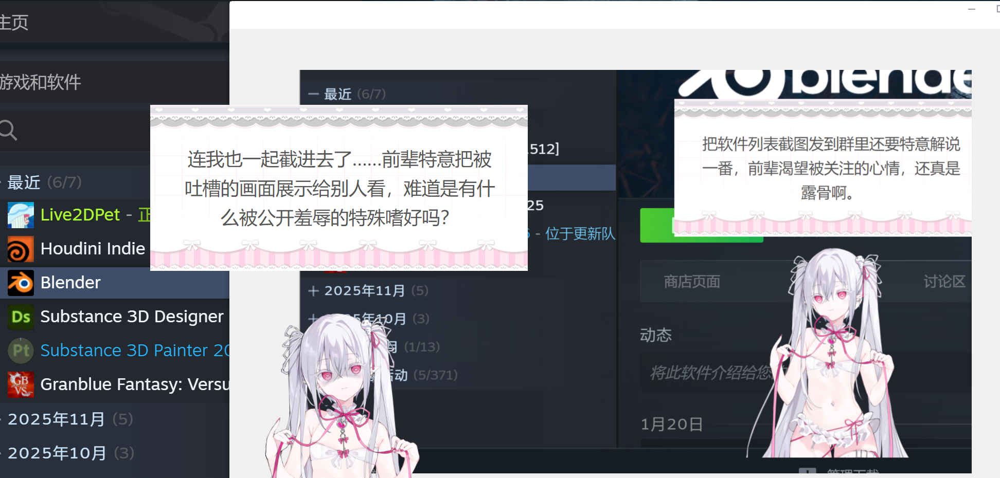

# Live2DPet — AI 桌面宠物伴侣

**[English](README.en.md)** | **[日本語](README.ja.md)** | **中文**

基于 Electron 的桌面宠物。Live2D 角色常驻桌面，通过截屏感知你的操作，AI 大模型生成陪伴式对话，VOICEVOX 语音合成实现语音输出。开发过程中使用 [Claude Code](https://docs.anthropic.com/en/docs/claude-code) 进行 AI 辅助编程。

> **隐私提示**: 本应用会定时截取屏幕画面并发送至你配置的 AI API 进行分析，截图不会保存到本地磁盘。请确保你信任所使用的 API 服务商，并注意避免在屏幕上显示敏感信息。

<p align="center">
  
</p>

## 使用示例

<p align="center">
  
  
</p>

**模型借物说明**

【Model】Little Demon
Author：Cai Cat様

【Model】春日部つむぎ (公式)
イラスト：春日部つくし様
モデリング：米田らん様

*本示例使用的 Live2D 模型为借物展示，版权归原作者所有。*

## 快速开始

### 方式一：直接下载（推荐）

从 [Releases](https://github.com/x380kkm/Live2DPet/releases) 下载 `Live2DPet.exe`，双击运行，无需安装。

### 方式二：从源码运行

```bash
git clone https://github.com/x380kkm/Live2DPet.git
cd Live2DPet
npm install
node launch.js
```

> VSCode 终端请用 `node launch.js`，不要用 `npx electron .`（ELECTRON_RUN_AS_NODE 冲突）。

## 使用指南

### 1. 配置 API

启动后打开设置面板，在「API 设置」标签页填入：

| 字段 | 说明 |
|------|------|
| API URL | 兼容 OpenAI 格式的接口地址 |
| API Key | 你的 API 密钥 |
| 模型名称 | 如 `x-ai/grok-4.1-fast` |

支持的服务：

| 服务 | baseURL | 模型示例 |
|------|---------|---------|
| OpenRouter | `https://openrouter.ai/api/v1` | `x-ai/grok-4.1-fast` |
| Grok 直连 | `https://api.x.ai/v1` | `grok-4.1-fast` |
| Deepseek | `https://api.deepseek.com/v1` | `deepseek-chat` |

推荐支持 Vision 的模型以获得截屏感知能力。

### 2. 导入 Live2D 模型

在「模型」标签页点击「选择模型文件夹」，选择包含 `.model.json` 或 `.model3.json` 的目录。系统会自动：
- 扫描模型参数并映射眼球/头部追踪
- 扫描表情文件和动作组
- 将模型复制到用户数据目录

也支持使用图片文件夹作为角色形象，详见下方「图片模型」。

### 3. 启动宠物

点击「启动宠物」，角色会以透明窗口出现在桌面右下角。
- 拖拽角色可移动位置
- 角色眼睛会跟随鼠标（Live2D 模式）
- AI 会定时截屏并通过气泡对话

### 图片模型

除 Live2D 外，还可以使用图片文件夹作为角色形象：

1. 在「模型」标签页选择类型为「图片文件夹」，选择包含 PNG/JPG/WebP 图片的文件夹
2. 为每张图片标记用途：待机、说话、表情（可多选）
3. 表情图片需填写表情名，AI 情绪系统会自动匹配
4. 可通过裁剪缩放滑块调整显示比例

AI 说话时自动切换到「说话」图片，触发情绪时切换到对应表情图片，空闲时显示「待机」图片。

### 4. 自定义角色人设

在「角色」标签页可以编辑角色的名称、性格、行为规则等。支持模板变量 `{{petName}}`、`{{userIdentity}}`。

### 5. VOICEVOX 语音合成（可选）

在「TTS」标签页可一键安装 VOICEVOX 组件。需要下载：
- VOICEVOX Core + ONNX Runtime
- VVM 语音模型（可在 UI 中选择下载）
- Open JTalk 辞書

支持 GPU 加速（DirectML）。AI 回复会自动翻译为日语并语音播放。

## 功能特性

- **Live2D 桌面角色** — 透明无边框窗口，始终置顶，眼睛跟随鼠标
- **图片模型** — 支持图片文件夹作为角色，按待机/说话/表情分类，AI 驱动自动切换
- **AI 视觉感知** — 定时截屏 + 活动窗口检测，AI 根据屏幕内容主动对话
- **VOICEVOX 语音** — 本地日语 TTS，自动翻译，一键安装
- **情绪系统** — AI 驱动表情/动作选择，情绪累积触发
- **音频状态机** — TTS → 默认音声 → 静音，三模式自动降级
- **模型热导入** — 任意 Live2D 模型，参数自动映射，表情/动作自动扫描
- **角色人设** — JSON 模板定义角色性格和行为规则，支持多角色切换

## 项目架构

```
Electron Main Process
├── main.js                 窗口管理 / IPC / 截屏 / 配置持久化
├── tts-service.js          VOICEVOX Core FFI (koffi)
└── translation-service.js  中→日 LLM 翻译 + LRU 缓存

Renderer (3 windows)
├── Settings Window         index.html + settings-ui.js
├── Pet Window              desktop-pet.html + model-adapter.js
└── Chat Bubble             pet-chat-bubble.html

Core Modules (renderer)
├── desktop-pet-system.js   调度: 截屏 / AI 请求 / 音频准备
├── message-session.js      协调: 文字 + 表情 + 音频同步播放
├── emotion-system.js       情绪累积 + AI 表情选择 + 动作触发
├── audio-state-machine.js  三模式降级状态机
├── ai-chat.js              OpenAI 兼容 API 客户端
└── prompt-builder.js       System Prompt 构建 (模板变量替换)
```

## 环境要求

- Windows 10/11
- Node.js >= 18（从源码运行时）
- OpenAI 兼容 API Key
- VOICEVOX Core（可选，用于语音合成）

## 测试

```bash
node tests/test-core.js
```

## 注意事项

- **隐私**: 截屏数据仅发送给你配置的 API，不存储到磁盘
- **API 费用**: 视觉模型调用会产生费用，合理设置检测间隔
- **VOICEVOX**: 使用语音时需标注 "VOICEVOX:キャラ名"

## 技术栈

- [Electron](https://www.electronjs.org/) — 桌面应用框架
- [Live2D Cubism SDK](https://www.live2d.com/en/sdk/about/) + [PixiJS](https://pixijs.com/) + [pixi-live2d-display](https://github.com/guansss/pixi-live2d-display)
- [VOICEVOX Core](https://github.com/VOICEVOX/voicevox_core) — 日语语音合成引擎
- [koffi](https://koffi.dev/) — Node.js FFI

## 更新日志

### v1.2.0 — 图片模型

- 新增图片文件夹模型：选择图片文件夹，为每张图片标记待机/说话/表情用途
- AI 说话时自动切换说话图片，情绪触发时切换表情图片
- 裁剪缩放控制，适配不同比例的角色图片
- 支持 PNG / JPG / WebP 格式

### 早期版本

- v1.1.0 — 快速响应模式、对话历史缓冲、截图去重、翻译与情绪系统语言无关化
- v1.0.0 — 初始版本：Live2D 桌面宠物、AI 视觉感知对话、VOICEVOX 语音合成、情绪/表情系统

## License

MIT — 详见 [LICENSE](LICENSE)。

## 征集

- **Live2D 模型**: 由于版权原因本库不提供默认模型，欢迎提供可供分发的 Live2D 模型
- **应用图标**: 当前图标为开发者头像占位，欢迎设计投稿
