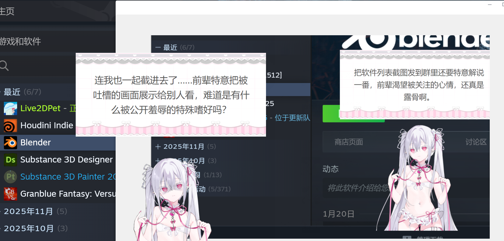
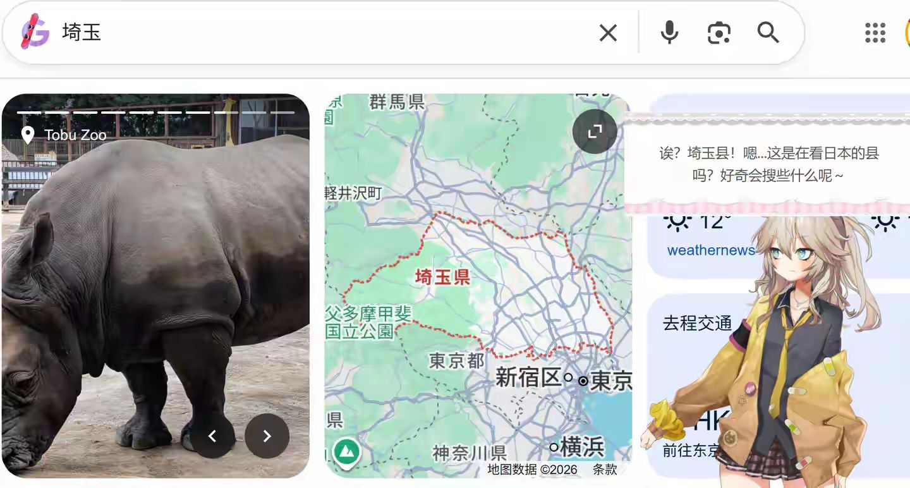
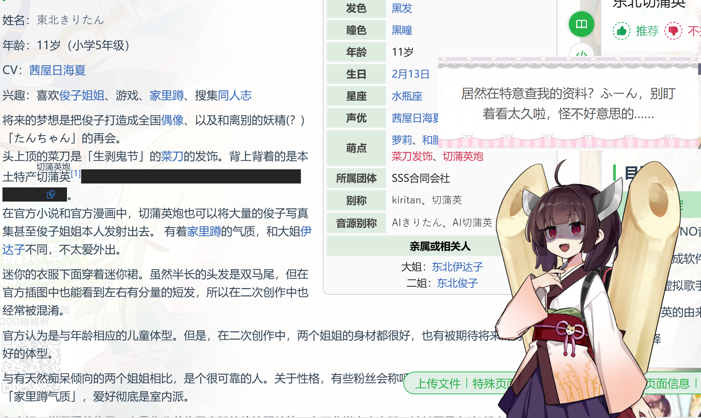

# Live2DPet — AI 桌面宠物伴侣

**[English](README.en.md)** | **[日本語](README.ja.md)** | **中文**

   

> 如果觉得有用，欢迎点个 [Star](https://github.com/x380kkm/Live2DPet) 支持一下 :)

基于 Electron 的桌面宠物。Live2D 角色常驻桌面，通过截屏和窗口感知理解你正在做什么，AI 大模型生成陪伴式对话，支持点击/拖拽等互动，关键帧视觉记忆让 AI 了解你的近期活动，VOICEVOX 语音合成实现语音输出。开发过程中使用 [Claude Code](https://docs.anthropic.com/en/docs/claude-code) 进行 AI 辅助编程。

> **隐私提示**: 本应用会定时截取屏幕画面并发送至你配置的 AI API 进行分析，截图不会保存到本地磁盘。请确保你信任所使用的 API 服务商，并注意避免在屏幕上显示敏感信息。

<p align="center">
  
</p>

## 使用示例

<p align="center">
  
</p>
<p align="center">
  
</p>
<p align="center">
  
</p>

<details>
<summary>模型借物说明</summary>

【Model】Little Demon<br>
Author：Cai Cat様

【Model】春日部つむぎ (公式)<br>
イラスト：春日部つくし様<br>
モデリング：米田らん様

【Model】東北きりたん ([水德式](https://www.bilibili.com/video/BV1B7dcY1EFU))<br>
イラスト：白白什么雨様<br>
配布：君临德雷克様

*本示例使用的模型素材为借物展示，版权归原作者所有。*

</details>

## 快速开始

### 方式一：直接下载（推荐）

从 [Releases](https://github.com/x380kkm/Live2DPet/releases) 下载 `Live2DPet.exe`，双击运行，无需安装。

### 方式二：从源码运行

```bash
git clone https://github.com/x380kkm/Live2DPet.git
cd Live2DPet
npm install
node launch.js
```

> VSCode 终端请用 `node launch.js`，不要用 `npx electron .`（ELECTRON_RUN_AS_NODE 冲突）。

## 使用指南

### 1. 配置 API

启动后打开设置面板，在「API 设置」标签页填入 API 地址、密钥和模型名称。本应用兼容所有 OpenAI 格式的 API 接口，可使用 OpenRouter 等聚合平台。

推荐使用支持 Vision 的模型以获得截屏感知能力：
- 性价比推荐：Grok 系列
- 中端推荐：GPT-o3 / GPT-5.1
- 高质量推荐：Gemini 3 Pro Preview

翻译 API（用于 TTS 日语翻译）推荐：
- OpenRouter `x-ai/grok-4-fast`

#### 模型路由（进阶）

在「Routing」标签页可以为不同任务分别配置模型，分两层：

- **大类**：截图（视觉语言模型）、文本（台词与场景路由等）、翻译，各选一个模型。
- **步骤**：每个步骤（台词生成、意图与场景路由、情绪选择、事件反应、mod 生成、翻译、关键帧选择、态势抽取）默认跟随所属大类；关掉该步骤的「跟随大类」开关，即可为它单独换模型或调温度。

支持 `openai-chat`、`claude`、`openai-responses` 三套接口兼容预设；可切到「JSON 高级」模式直接编辑整份配置。还能填写一段「额外系统提示词」，它会与出厂提示词合并——此项不做审查，由你自负。

> 不配置 Routing 时，沿用上面「API 设置」里的单一模型，所有任务共用它。

#### 用环境变量配置（可选，不想在界面里填密钥时用）

设了下列环境变量，应用启动时会优先采用它们，密钥不入界面、也不必落盘。环境变量优先于界面与文件配置。

- 按大类分模型:`LIVE2DPET_VLM_KEY/BASEURL/MODEL`(截图视觉模型)、`LIVE2DPET_LLM_KEY/BASEURL/MODEL`(文本:台词与路由)、`LIVE2DPET_TRANSLATE_KEY/BASEURL/MODEL`(翻译,缺省沿用文本大类)。每个大类另可加 `_PRESET`(`openai-chat`/`claude`/`openai-responses`)与 `_THINKING`(设 `off` 关闭思考)。
- 单模型回退:只给 `LIVE2DPET_API_KEY`、`LIVE2DPET_BASE_URL`、`LIVE2DPET_MODEL` 时,三个大类共用同一接入。
- Live2D 模型:`LIVE2DPET_MODEL_TYPE=live2d`、`LIVE2DPET_MODEL_PATH=<模型文件夹>`、`LIVE2DPET_MODEL_FILE=<xxx.model3.json>`。
- 额外系统提示词:`LIVE2DPET_SYSTEM_INJECTION`,与出厂提示词合并(不审查,自负)。
- 开机即显示桌宠:`LIVE2DPET_AUTOLAUNCH=1`(默认不设时,先出现设置窗口,点「启动宠物」才显示桌宠)。

可以把这些写进一个启动脚本,运行它来带配置启动。仓库根的 `start-pet.ps1` 就是这样一个示例启动器(含密钥,已加入 `.gitignore` 不会提交);按里面的注释填好 API 与模型后,在 PowerShell 里运行 `./start-pet.ps1` 即可。

### 2. 导入 Live2D 模型

在「模型」标签页点击「选择模型文件夹」，选择包含 `.model.json` 或 `.model3.json` 的目录。系统会自动：
- 扫描模型参数并映射眼球/头部追踪
- 扫描表情文件和动作组
- 将模型复制到用户数据目录

也支持使用图片文件夹作为角色形象，详见下方「图片模型」。

> 没有 Live2D 模型？可以从 [Live2D 官方示例](https://www.live2d.com/en/learn/sample/) 下载免费模型体验。

### 3. 配置 VOICEVOX 语音合成（可选）

> 先到 [VOICEVOX 官网](https://voicevox.hiroshiba.jp/) 试听角色和风格，找到喜欢的再下载对应模型。

1. 在「TTS」标签页安装 VOICEVOX 组件（Core + ONNX Runtime + Open JTalk 辞書）
2. 选择并下载 VVM 语音模型
3. 点击「保存并重启」按钮，等待应用重启加载模型
4. 设置角色（Speaker）、风格（Style）及其他语音参数微调

支持 GPU 加速（DirectML）。AI 回复会自动翻译为日语并语音播放。

<details>
<summary>手动安装 VOICEVOX 组件</summary>

如果应用内一键安装失败，可以手动下载并放置文件。

**安装位置**: `C:\Users\你的用户名\AppData\Roaming\live2dpet\voicevox_core`

> 将「你的用户名」替换为你的 Windows 用户名。

**下载链接**:

| 组件 | 必须 | 下载链接 |
|------|------|----------|
| VOICEVOX Core | 是 | [voicevox_core-windows-x64-0.16.3.zip](https://github.com/VOICEVOX/voicevox_core/releases/download/0.16.3/voicevox_core-windows-x64-0.16.3.zip) |
| ONNX Runtime (CPU) | 是 | [voicevox_onnxruntime-win-x64-1.17.3.tgz](https://github.com/VOICEVOX/onnxruntime-builder/releases/download/voicevox_onnxruntime-1.17.3/voicevox_onnxruntime-win-x64-1.17.3.tgz) |
| ONNX Runtime (GPU) | 否 | [voicevox_onnxruntime-win-x64-dml-1.17.3.tgz](https://github.com/VOICEVOX/onnxruntime-builder/releases/download/voicevox_onnxruntime-1.17.3/voicevox_onnxruntime-win-x64-dml-1.17.3.tgz) |
| Open JTalk 辞書 | 是 | [open_jtalk_dic_utf_8-1.11.tar.gz](https://sourceforge.net/projects/open-jtalk/files/Dictionary/open_jtalk_dic-1.11/open_jtalk_dic_utf_8-1.11.tar.gz/download) |
| 默认语音模型 | 是 | [0.vvm](https://github.com/VOICEVOX/voicevox_vvm/releases/download/0.16.3/0.vvm) |
| 其他语音模型 | 否 | [vvm](https://github.com/VOICEVOX/voicevox_vvm/releases/)|

**解压后的目录结构**:

```
voicevox_core/
├── c_api/
│   └── voicevox_core-windows-x64-0.16.3/
│       └── lib/
│           └── voicevox_core.dll
├── voicevox_onnxruntime-win-x64-1.17.3/
│   └── lib/
│       └── voicevox_onnxruntime.dll
├── open_jtalk_dic_utf_8-1.11/
│   ├── sys.dic
│   └── ...
└── models/
    ├── 0.vvm
    └── ...
```

将下载的文件解压到上述对应位置，`.vvm` 文件放入 `models/` 文件夹，然后重启应用即可。

</details>

### 4. 自定义角色人设

在「角色」标签页新增角色卡，编辑角色的名称、性格、行为规则等。支持模板变量 `{{petName}}`、`{{userIdentity}}`。

### 5. 启动宠物

在设置界面底部点击「启动宠物」，角色会以透明窗口出现在桌面右下角。
- 拖拽角色可移动位置
- 角色眼睛会跟随鼠标（Live2D 模式）
- AI 会定时截屏并通过气泡对话

### 图片模型

除 Live2D 外，还可以使用图片文件夹作为角色形象：

1. 在「模型」标签页选择类型为「图片文件夹」，选择包含 PNG/JPG/WebP 图片的文件夹
2. 为每张图片标记用途：待机、说话、表情（可多选）
3. 表情图片需填写表情名，AI 情绪系统会自动匹配
4. 可通过裁剪缩放滑块调整显示比例

AI 说话时自动切换到「说话」图片，触发情绪时切换到对应表情图片，空闲时显示「待机」图片。

## 功能特性

- **Live2D 桌面角色** — 透明无边框窗口，始终置顶，眼睛跟随鼠标
- **图片模型** — 支持图片文件夹作为角色，按待机/说话/表情分类，AI 驱动自动切换
- **AI 视觉感知** — 定时截屏 + 活动窗口检测，AI 根据屏幕内容主动对话
- **互动系统(模组化)** — 点击、触摸等身体交互抽象为模组,交互事件触发对应意图,驱动角色作出反应;可执行 mod 前端跑在 iframe 沙箱里
- **关键帧视觉记忆** — 自动采样截图，VLM 挑选代表性关键帧，AI 可回顾近期活动
- **VOICEVOX 语音** — 本地日语 TTS，自动翻译，一键安装
- **情绪系统** — AI 驱动表情/动作选择，情绪累积触发
- **音频状态机** — TTS → 默认音声 → 静音，三模式自动降级
- **模型热导入** — 任意 Live2D 模型，参数自动映射，表情/动作自动扫描
- **角色人设** — JSON 模板定义角色性格和行为规则，支持多角色切换

> **已弃置**: 智能增强文本管线（自动搜索、知识整理、知识获取、活动记忆、VLM 情景提取）已在 v2.0 中暂停使用，代码骨架保留。

<details>
<summary>项目架构</summary>

三层架构:`platform`(地基与第三方适配)、`domain`(角色核心纯逻辑)、`renderer`(三个窗口的表现层),由 `main.js` 作为组合根按依赖序装配,经构造注入串起。第三方类型(electron、koffi、PIXI)只在 `platform` 出现,`domain` 不碰任何第三方。

```
主进程
├── main.js                  组合根:装配 platform 与 domain,挂生命周期、窗口与 IPC
├── preload.js               按能力域暴露 petBridge 窄接口(ui/config/character/emotion/tts/screen/outbound/file)
├── src/main/                crypto-utils(AES-256-GCM 密钥加解密)、validators(UUID/URL/路径校验)
├── src/shared/              跨层常量:step-catalog(AI 步骤目录)、ids、i18n
├── src/platform/            地基与适配
│   ├── llm/                 llm-client、vendor-profiles(claude/openai-chat/openai-responses)、model-router、step-model-config、translation-service
│   ├── config/              config-store(分字段加密)、layered-config(三层就近覆盖)、machine-settings、preset-loader、language-state
│   ├── ipc/                 channel-registry、ipc-router、capability-gateway、handlers/*
│   ├── electron/            window-factory、tray-factory、screen-source、active-window-source、search-source
│   ├── render/              live2d-renderer、image-renderer、model-renderer
│   ├── speech/              voicevox-backend(koffi FFI)、circuit-breaker、voicevox-installer
│   ├── storage/             file-repository、path-utils
│   ├── mod/                 mod-source(从 assets/mods 与用户 mods 目录读模组规格)
│   ├── window/              expression-arbiter(气泡与 mod 前端窗口同一时刻至多一个占主导)
│   ├── sandbox/             sandbox-host、sandbox-bridge(可执行 mod 前端的 iframe 沙箱边界)
│   └── bus/                 event-bus
└── src/domain/              角色核心(纯逻辑)
    ├── pet/                 pet 编排、request-pipeline、prompt-composer、perception-collector、scheduler、interaction-router(交互事件驱动意图)、上下文源 sources/*
    ├── intent/              intent、intent-registry、builtin-intents
    ├── model/               step-registry(AI 步骤反射注入式注册)
    ├── fewshot/             fewshot-bank、fewshot-resolver
    ├── perception/          keyframe-buffer、vlm-extractor、memory-store
    ├── emotion/             emotion-state、emotion-selector
    ├── statemachine/        state-machine、reaction-policy、reaction-driver(边界事件驱动有界反应)
    ├── mod/                 mod、mod-registry、mod-generator、interaction-event
    ├── speech/              utterance、utterance-session
    └── tts/                 tts-orchestrator

渲染层(四个窗口)
├── 设置窗口    settings.html + src/renderer/settings/*(settings-app、各 panel、settings-model、gateway)
├── 桌宠窗口    desktop-pet.html + src/renderer/boot/stage-boot + src/renderer/stage/*
├── 对话气泡    pet-chat-bubble.html + src/renderer/pet-chat-bubble.js(浮在桌宠上方的独立窗口)
└── mod 前端    mod-frontend.html + src/renderer/mod-frontend.js + src/renderer/mod/mod-mounter(纯数据档直渲、可执行档走 iframe 沙箱)
```

**模组(mod)体系**:用户交互被抽象为模组——一份声明了交互事件、意图与前端规格的纯数据单元。出厂模组随程序发布在 `assets/mods/`,用户模组放在用户数据目录的 `mods/`;信任级别由来源目录决定。模组的意图在加载期被发现并注入意图注册表;交互事件经事件总线触发声明消费它的意图,跑出台词或情绪。默认出厂一个身体交互模组(把点击、触摸做成模组,替代旧的硬编码上报)。可执行的 mod 前端跑在只给 `allow-scripts`、不给 `allow-same-origin` 的 iframe 沙箱里,经收窄的消息白名单回传交互,拿不到 `petBridge`。

</details>

<details>
<summary>环境要求</summary>

- Windows 10/11
- Node.js >= 18（从源码运行时）
- OpenAI 兼容 API Key
- VOICEVOX Core（可选，用于语音合成）

</details>

<details>
<summary>测试</summary>

```bash
npm test
```

</details>

## 注意事项

- **隐私**: 截屏数据仅发送给你配置的 API，不存储到磁盘
- **API 费用**: 视觉模型调用会产生费用，合理设置检测间隔
- **VOICEVOX**: 使用语音时需标注 "VOICEVOX:キャラ名"

## 问题排查

遇到问题时，请打开命令提示符（cmd），通过以下命令启动程序以开启控制台日志：

```bash
"你的文件夹地址\Live2DPet.exe" --enable-logging 2>&1
```

请记录出现问题时的日志输出，提交 Issue 时附上相关信息。

### 已知问题

- 关于截屏错误的 warning 请忽视，不影响正常使用
- VVM 语音模型读取错误：前往 `C:\Users\你的用户名\AppData\Roaming\live2dpet\voicevox_core`，找到存放模型的文件夹，删除损坏的文件后重新下载

<details>
<summary>技术栈</summary>

- [Electron](https://www.electronjs.org/) — 桌面应用框架
- [Live2D Cubism SDK](https://www.live2d.com/en/sdk/about/) + [PixiJS](https://pixijs.com/) + [pixi-live2d-display](https://github.com/guansss/pixi-live2d-display)
- [VOICEVOX Core](https://github.com/VOICEVOX/voicevox_core) — 日语语音合成引擎
- [koffi](https://koffi.dev/) — Node.js FFI

</details>

## 更新日志

详见 [CHANGELOG.md](CHANGELOG.md)。

## License

MIT — 详见 [LICENSE](LICENSE)。

## 征集

- **Live2D 模型**: 由于版权原因本库不提供默认模型，欢迎提供可供分发的 Live2D 模型
- **应用图标**: 当前图标为开发者头像占位，欢迎设计投稿
- **内置角色卡**: 欢迎提交有趣的角色卡！内置角色卡需提供中/英/日三语版本。提交时需新增 `assets/prompts/<uuid>.json`（含 `i18n` 字段），并把它登记进 `main.js` 的内置卡迁移流程（`makeBundledCards` 与 `migrateBundledCards`）。格式参考现有内置卡

<details>
<summary>内置角色卡列表</summary>

> 英语和日语版本为机翻，欢迎校对。

| 角色名 | 中文 | English | 日本語 | 备注 |
|--------|------|---------|--------|------|
| 后辈 / Kouhai / 後輩 | ✅ 原文 | ✅ 机翻 | ✅ 机翻 | 默认角色，毒舌后辈型桌宠 |

</details>

## 贡献者

<a href="https://github.com/x380kkm/Live2DPet/graphs/contributors">
  
</a>

## 赞助者

完整列表见 [SPONSORS.md](SPONSORS.md)。

| 赞助者 |
|--------|
| 柠檬 |

## Star History

[](https://star-history.com/#x380kkm/Live2DPet&Date)
